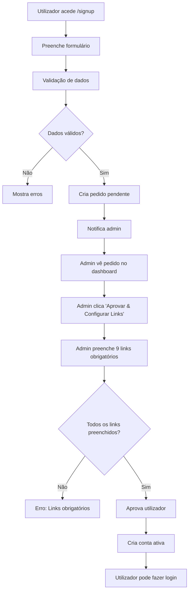
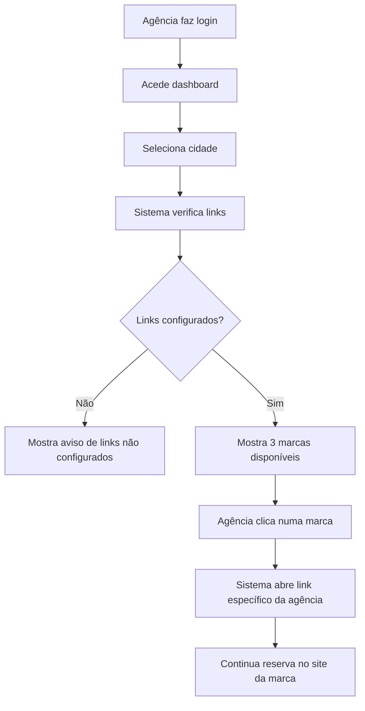
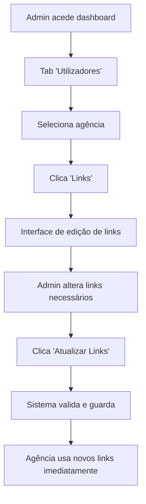

# 📋 MULTIPARK AGÊNCIAS - DOCUMENTAÇÃO TÉCNICA COMPLETA

## 📑 Índice

1. [Visão Geral do Sistema](#visão-geral-do-sistema)
2. [Arquitetura e Tecnologias](#arquitetura-e-tecnologias)
3. [Funcionalidades Detalhadas](#funcionalidades-detalhadas)
4. [Sistema de Links Personalizados](#sistema-de-links-personalizados)
5. [Credenciais e Contas de Teste](#credenciais-e-contas-de-teste)
6. [Fluxos de Trabalho](#fluxos-de-trabalho)
7. [Estrutura do Código](#estrutura-do-código)
8. [Instalação e Configuração](#instalação-e-configuração)
9. [Deploy e Produção](#deploy-e-produção)
10. [Troubleshooting](#troubleshooting)
11. [Manutenção e Atualizações](#manutenção-e-atualizações)

---

## 🎯 Visão Geral do Sistema

O **Multipark Agências** é um portal web desenvolvido para gerir o acesso de agências de viagem aos serviços de estacionamento das três marcas do grupo Multipark:

- **🔵 Airpark** - Estacionamento aeroportuário
- **🔴 Redpark** - Soluções urbanas de estacionamento
- **🟣 Skypark** - Estacionamento premium

### **Principais Objetivos**
- Centralizar o acesso das agências aos serviços Multipark
- Gerir links personalizados com comissões específicas por agência
- Controlar aprovações e permissões de utilizadores
- Providenciar interface administrativa completa

---

## 🏗️ Arquitetura e Tecnologias

### **Stack Frontend**
- **React 18.3** - Biblioteca principal
- **TypeScript 5.5** - Tipagem estática
- **Vite 5.4** - Build tool e dev server
- **Tailwind CSS 3.4** - Framework de estilos
- **Shadcn/UI** - Sistema de componentes

### **Bibliotecas Principais**
- **React Router DOM 6.26** - Navegação SPA
- **Sonner** - Sistema de notificações
- **Lucide React** - Biblioteca de ícones
- **localStorage API** - Persistência de dados

### **Estrutura de Dados**
```typescript
interface User {
  name: string;
  email: string;
  phone?: string;
  nif?: string;
  role: 'admin' | 'user';
  status: 'active' | 'pending' | 'inactive';
  observations?: string;
  links?: {
    lisbon: { airpark: string; redpark: string; skypark: string };
    porto: { airpark: string; redpark: string; skypark: string };
    faro: { airpark: string; redpark: string; skypark: string };
  };
}
```

---

## ⚙️ Funcionalidades Detalhadas

### **👤 Sistema de Autenticação**

#### **Para Utilizadores (Agências)**
- **Login seguro** com validação de credenciais
- **Registo self-service** com formulário completo
- **Recuperação de password** via administrador
- **Alteração de password** no perfil
- **Sessão persistente** até logout manual

#### **Para Administrador**
- **Login privilegiado** com acesso total
- **Dashboard administrativo** com múltiplas funcionalidades
- **Gestão completa** de utilizadores e pedidos

### **🏢 Gestão de Utilizadores**

#### **Pedidos Pendentes**
- Visualização de novos registos
- Informações completas da agência
- **Aprovação com configuração obrigatória de links**
- Rejeição com remoção automática

#### **Utilizadores Ativos**
- Lista completa de agências aprovadas
- Ativação/desativação de contas
- Reset de passwords
- **Gestão individual de links personalizados**

### **🏙️ Sistema Multi-Cidade**
- **Lisboa** - Hub principal de negócios
- **Porto** - Segundo maior centro
- **Faro** - Gateway para o Algarve

### **🎯 Dashboard Personalizado**
- Interface específica por tipo de utilizador
- Acesso rápido às funcionalidades principais
- Estatísticas em tempo real (admin)
- Navegação intuitiva entre cidades (utilizador)

---

## 🔗 Sistema de Links Personalizados

### **Conceito Base**
Cada agência possui **9 links únicos** (3 cidades × 3 marcas), onde cada link contém:
- **Comissões específicas** da agência
- **Parâmetros de tracking** únicos
- **Campanha personalizada** com identificação da agência

### **Estrutura dos Links**
```
https://multipark.pt/book?city={cidade}&parkBrand={marca}&campaignId={campanha_unica}
```

**Exemplos Reais:**
```
Lisboa + Redpark:
https://multipark.pt/book?city=lisbon&parkBrand=redpark&campaignId=ZOJniuQ4WvDtOUU8HfbV

Porto + Airpark:  
https://multipark.pt/book?city=porto&parkBrand=airpark&campaignId=ABC123DEF456GHI789

Faro + Skypark:
https://multipark.pt/book?city=faro&parkBrand=skypark&campaignId=XYZ789ABC123DEF456
```

### **Matriz de Links por Agência**
| Cidade | Airpark | Redpark | Skypark |
|--------|---------|---------|---------|
| **Lisboa** | Link único A | Link único B | Link único C |
| **Porto** | Link único D | Link único E | Link único F |
| **Faro** | Link único G | Link único H | Link único I |

### **Processo de Criação dos Links**
1. **Admin cria links externamente** no sistema de reservas Multipark
2. **Cada link tem comissões específicas** da agência
3. **Admin cola os links** no painel administrativo
4. **Sistema valida presença** de todos os 9 links
5. **Aprovação só acontece** com todos os links configurados

### **Estados dos Links**
- ✅ **Configurado** - Link válido e funcional
- ⚠️ **Não Configurado** - Slot vazio, utilizador não pode reservar
- 🔒 **Agência Inativa** - Links desabilitados temporariamente

---

## 🔑 Credenciais e Contas de Teste

### **👨‍💼 Conta Administrador**
```
Email: Info@multipark.pt
Password: Multipark$25
```

**Acesso a:**
- Dashboard administrativo completo
- Aprovação/rejeição de novos utilizadores
- Configuração de links personalizados
- Reset de passwords de utilizadores
- Gestão de status das contas
- Estatísticas do sistema

### **🏢 Contas de Agência (Exemplos)**

#### **Agência com Links Configurados**
```
Email: guimaraes1@bestravel.pt
Password: Multipak*
Nome: AzulViajante
Status: ✅ Ativa com todos os links configurados
```

#### **Agência sem Links**
```
Email: castelobranco@bestravel.pt  
Password: Multipak*
Nome: Bestravel Castelo Branco
Status: ⚠️ Ativa mas sem links configurados
```

### **📝 Dados para Teste de Registo**
```
Nome da Agência: Teste Travel Agência
Email: teste@testetravel.pt
Telefone: +351 912 345 678
NIF: 123456789
Observações: Agência de teste para validação do sistema
```

---

## 🔄 Fluxos de Trabalho

### **1. Fluxo de Registo de Nova Agência**



### **2. Fluxo de Reserva**



### **3. Fluxo de Gestão de Links (Admin)**



---

## 📁 Estrutura do Código

```
src/
├── components/              # Componentes reutilizáveis
│   ├── Header.tsx          # Cabeçalho com navegação e dropdown
│   └── ui/                 # Biblioteca Shadcn/UI
│       ├── button.tsx      # Componente de botão
│       ├── card.tsx        # Componentes de card
│       ├── dialog.tsx      # Modais e diálogos
│       ├── input.tsx       # Campos de input
│       ├── tabs.tsx        # Sistema de tabs
│       └── ...             # Outros componentes UI
├── contexts/               # Contextos React
│   └── AuthContext.tsx     # Gestão de autenticação e estado global
├── pages/                  # Páginas da aplicação
│   ├── Index.tsx          # Página inicial (landing)
│   ├── Login.tsx          # Página de login
│   ├── SignUp.tsx         # Registo de novas agências
│   ├── ForgotPassword.tsx # Recuperação de password
│   ├── Dashboard.tsx      # Dashboard do utilizador
│   ├── AdminDashboard.tsx # Dashboard administrativo
│   ├── UserProfile.tsx    # Perfil e alteração de password
│   ├── CityPage.tsx       # Seleção de marcas por cidade
│   └── ...                # Outras páginas (About, Contact, etc.)
├── utils/                 # Utilitários e helpers
├── App.tsx                # Componente principal com rotas
└── main.tsx               # Entry point da aplicação
```

### **Componentes Principais**

#### **AuthContext.tsx**
- **Responsabilidade**: Gestão de autenticação e estado global
- **Funcionalidades**:
  - Login/logout de utilizadores
  - Registo de novas agências
  - Gestão de utilizadores ativos e pendentes
  - Persistência de dados no localStorage
  - Funções administrativas

#### **AdminDashboard.tsx**
- **Responsabilidade**: Interface administrativa completa
- **Funcionalidades**:
  - Gestão de pedidos pendentes
  - Aprovação com configuração obrigatória de links
  - Gestão de utilizadores ativos
  - Reset de passwords
  - Estatísticas do sistema

#### **CityPage.tsx**
- **Responsabilidade**: Interface de seleção de marcas por cidade
- **Funcionalidades**:
  - Verificação de links configurados
  - Redirecionamento para links específicos da agência
  - Feedback visual do estado dos links

---

## 🚀 Instalação e Configuração

### **Pré-requisitos**
- **Node.js** versão 18 ou superior
- **npm** ou **bun** como package manager
- **Git** para controlo de versões

### **Instalação Local**

```bash
# 1. Clonar o repositório
git clone https://github.com/JorgeTabuada/Multipark-Agencias.git
cd Multipark-Agencias

# 2. Instalar dependências
npm install
# ou
bun install

# 3. Iniciar servidor de desenvolvimento
npm run dev
# ou
bun dev

# 4. Abrir no browser
# http://localhost:5173
```

### **Scripts Disponíveis**

```json
{
  "dev": "vite",                    // Servidor de desenvolvimento
  "build": "tsc -b && vite build", // Build para produção
  "lint": "eslint .",               // Linting do código
  "preview": "vite preview"         // Preview do build
}
```

### **Configuração de Ambiente**

O sistema não requer variáveis de ambiente para funcionar localmente, mas pode ser configurado para produção:

```bash
# .env (opcional)
VITE_API_URL=https://api.multipark.pt
VITE_ENVIRONMENT=production
```

---

## 🌐 Deploy e Produção

### **Deploy na Vercel (Recomendado)**

```bash
# 1. Conectar repositório GitHub à Vercel
# 2. Configurar build settings:
Build Command: npm run build
Output Directory: dist
Install Command: npm install

# 3. Deploy automático em cada push para main
```

### **Deploy Manual**

```bash
# 1. Build do projeto
npm run build

# 2. Upload da pasta 'dist' para servidor
# 3. Configurar servidor web (Nginx/Apache)
```

### **Configuração de Servidor Web**

**Nginx:**
```nginx
server {
    listen 80;
    server_name agencias.multipark.pt;
    
    location / {
        root /var/www/multipark-agencias/dist;
        try_files $uri $uri/ /index.html;
    }
}
```

**Apache:**
```apache
<VirtualHost *:80>
    ServerName agencias.multipark.pt
    DocumentRoot /var/www/multipark-agencias/dist
    
    <Directory /var/www/multipark-agencias/dist>
        Options Indexes FollowSymLinks
        AllowOverride All
        Require all granted
    </Directory>
</VirtualHost>
```

---

## 🔧 Troubleshooting

### **Problemas Comuns**

#### **1. Erro de Build no Deploy**
```bash
# Erro: Transform failed with X errors
# Solução: Verificar sintaxe TypeScript em ficheiros .tsx
```

#### **2. Dados Desaparecem Após Refresh**
```bash
# Problema: localStorage não está a funcionar
# Solução: Verificar permissões do browser e HTTPS
```

#### **3. Links Não Funcionam**
```bash
# Problema: Links não configurados ou inválidos
# Solução: Admin deve configurar todos os 9 links obrigatórios
```

#### **4. Utilizador Não Consegue Fazer Login**
```bash
# Possíveis causas:
# - Password incorreta
# - Conta não aprovada (status: pending)
# - Conta desativada (status: inactive)
```

### **Debug e Logs**

#### **Verificar Estado da Aplicação**
```javascript
// Console do browser
console.log('Users:', JSON.parse(localStorage.getItem('multipark_users')));
console.log('Pending:', JSON.parse(localStorage.getItem('multipark_pending_users')));
console.log('Passwords:', JSON.parse(localStorage.getItem('multipark_passwords')));
```

#### **Reset Completo dos Dados**
```javascript
// Console do browser - CUIDADO: Remove todos os dados
localStorage.removeItem('multipark_users');
localStorage.removeItem('multipark_pending_users');
localStorage.removeItem('multipark_passwords');
location.reload();
```

---

## 🛠️ Manutenção e Atualizações

### **Tarefas de Manutenção Regular**

#### **Gestão de Utilizadores**
- Revisar pedidos pendentes semanalmente
- Validar links de agências mensalmente
- Limpar contas inativas semestralmente

#### **Atualizações de Sistema**
- Atualizar dependências trimestralmente
- Backup de dados antes de atualizações
- Testar funcionalidades após atualizações

### **Procedimentos de Backup**

#### **Backup de Dados (localStorage)**
```javascript
// Exportar dados
const backup = {
  users: localStorage.getItem('multipark_users'),
  pending: localStorage.getItem('multipark_pending_users'),
  passwords: localStorage.getItem('multipark_passwords'),
  timestamp: new Date().toISOString()
};

console.log('Backup:', JSON.stringify(backup, null, 2));
```

#### **Restaurar Dados**
```javascript
// Importar dados de backup
const backup = { /* dados do backup */ };
localStorage.setItem('multipark_users', backup.users);
localStorage.setItem('multipark_pending_users', backup.pending);
localStorage.setItem('multipark_passwords', backup.passwords);
location.reload();
```

### **Monitorização**

#### **Métricas Importantes**
- Número de utilizadores ativos
- Pedidos pendentes por semana
- Links não configurados
- Tentativas de login falhadas

#### **Alertas Recomendados**
- +5 pedidos pendentes por aprovar
- Utilizadores sem links configurados há +7 dias
- Tentativas de login suspeitas

---

## 📊 Estatísticas e Analytics

### **Métricas do Sistema**
```typescript
interface SystemMetrics {
  totalUsers: number;           // Total de utilizadores ativos
  pendingUsers: number;         // Pedidos pendentes
  activeUsers: number;          // Utilizadores ativos
  inactiveUsers: number;        // Utilizadores desativados
  linksConfigured: number;      // % de links configurados
  lastLogin: Date;              // Último login registado
}
```

### **Relatórios Disponíveis**
- Utilizadores por estado (ativo/inativo/pendente)
- Agências com links não configurados
- Histórico de aprovações mensais
- Estatísticas de uso por cidade/marca

---

## 🎯 Roadmap e Melhorias Futuras

### **Próximas Funcionalidades**
- **Base de dados real** (PostgreSQL/MySQL)
- **Sistema de notificações** por email
- **Dashboard de analytics** avançado
- **API REST** para integrações
- **Backup automático** de dados
- **Sistema de logs** detalhado

### **Melhorias de UX/UI**
- **Dark mode** opcional
- **Mobile app** nativa
- **Notificações push**
- **Drag & drop** para gestão
- **Filtros avançados** no dashboard

### **Segurança**
- **Autenticação 2FA**
- **Encriptação de dados**
- **Audit logs**
- **Rate limiting**
- **HTTPS obrigatório**

---

## 📞 Contactos e Suporte

### **Suporte Técnico**
- **Email**: Info@multipark.pt
- **Desenvolvedor**: Jorge Tabuada
- **Empresa**: Multipark

### **Documentação Adicional**
- **Repositório**: https://github.com/JorgeTabuada/Multipark-Agencias
- **Issues**: https://github.com/JorgeTabuada/Multipark-Agencias/issues
- **Releases**: https://github.com/JorgeTabuada/Multipark-Agencias/releases

---

## 📄 Licença e Direitos

**© 2025 Multipark - Todos os direitos reservados**

Este sistema foi desenvolvido exclusivamente para uso interno do grupo Multipark e suas agências parceiras. Não é permitida a reprodução, distribuição ou uso comercial sem autorização expressa.

---

*Documentação atualizada em: Janeiro 2025*  
*Versão do Sistema: 1.0.0*  
*Última Revisão: Jorge Tabuada*