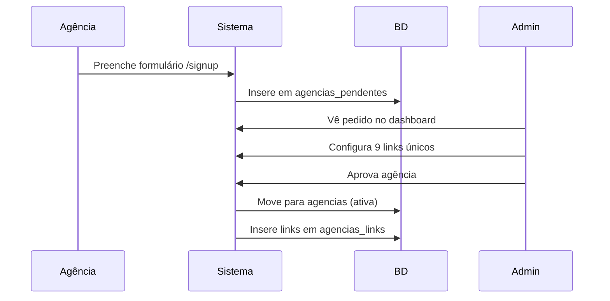
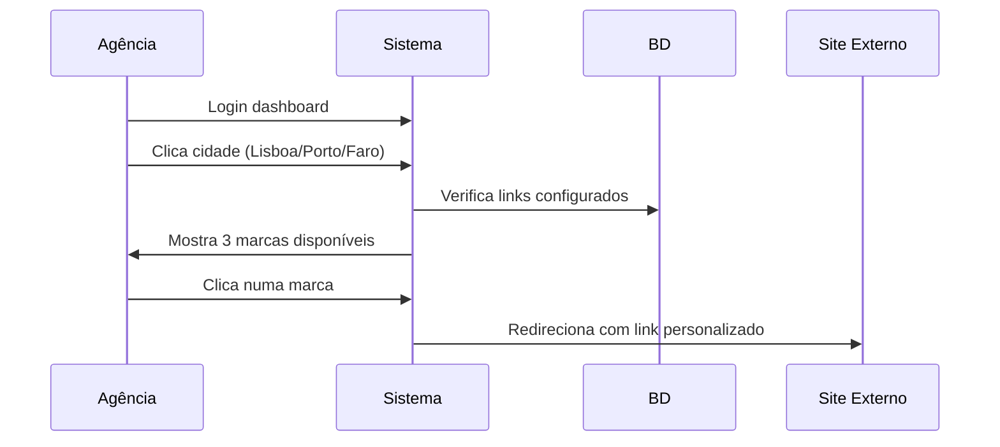
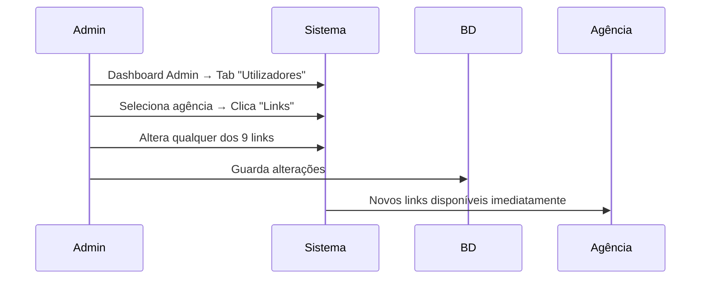

# 🚗 Multipark Agências - Sistema de Gestão de Agências de Viagem

## 📋 Visão Geral

O **Multipark Agências** é um portal web desenvolvido para gerir o acesso de agências de viagem aos serviços de estacionamento das três marcas do grupo Multipark. O sistema permite que cada agência tenha links personalizados com comissões específicas para reservas de estacionamento.

### 🏢 Marcas Suportadas
- **🔵 Airpark** - Estacionamento aeroportuário  
- **🔴 Redpark** - Soluções urbanas de estacionamento
- **🟣 Skypark** - Estacionamento premium

### 🌍 Cidades Disponíveis
- **Lisboa** - Hub principal
- **Porto** - Segundo maior centro  
- **Faro** - Gateway para o Algarve

---

## ✨ Funcionalidades Principais

### 👤 Para Agências de Viagem
- ✅ **Login seguro** com credenciais únicas
- ✅ **Dashboard personalizado** por agência  
- ✅ **Acesso direto** às três cidades
- ✅ **Links personalizados** com comissões específicas
- ✅ **Alteração de password** no perfil
- ✅ **Interface responsiva** para desktop e mobile

### 👨‍💼 Para Administradores
- ✅ **Dashboard administrativo** completo
- ✅ **Aprovação de agências** com configuração obrigatória de links
- ✅ **Gestão de utilizadores** (ativar/desativar)
- ✅ **Configuração manual** dos 9 links únicos por agência
- ✅ **Reset de passwords** de utilizadores  
- ✅ **Estatísticas do sistema** em tempo real
- ✅ **Aprovação em lote** de agências pendentes

---

## 🛠️ Stack Tecnológico

### Frontend
- **React 18** - Biblioteca principal
- **TypeScript** - Tipagem estática
- **Vite** - Build tool e dev server  
- **Tailwind CSS** - Framework de CSS
- **Shadcn/UI** - Componentes de interface
- **React Router** - Navegação SPA
- **React Hook Form** - Gestão de formulários
- **Zod** - Validação de schemas

### Backend & Database
- **Supabase** - Backend-as-a-Service
- **PostgreSQL** - Base de dados relacional
- **Row Level Security (RLS)** - Segurança a nível de linha

### Deploy & DevOps
- **Vercel** - Deploy e hosting
- **GitHub Actions** - CI/CD automático
- **ESLint** - Linting de código
- **TypeScript** - Type checking

---

## 🚀 Instalação e Configuração

### Pré-requisitos
- Node.js 18+ 
- npm ou yarn
- Git

### 1. Clonar o Repositório
```bash
git clone https://github.com/JorgeTabuada/Multipark-Agencias.git
cd Multipark-Agencias
```

### 2. Instalar Dependências
```bash
npm install
```

### 3. Configuração do Ambiente
O projeto já está configurado com Supabase. As credenciais estão em:
- `src/lib/supabase.ts`

### 4. Executar em Desenvolvimento
```bash
npm run dev
```

### 5. Build para Produção
```bash
npm run build
```

---

## 🌐 Deploy no Vercel

### Deploy Automático
1. Aceder a **[vercel.com](https://vercel.com)**
2. Conectar com GitHub
3. Importar repositório `JorgeTabuada/Multipark-Agencias`
4. Configurações automáticas:
   - **Framework:** Vite
   - **Build Command:** `npm run build`
   - **Output Directory:** `dist`
5. Deploy automático ✅

### Deploy Manual (CLI)
```bash
npm i -g vercel
vercel --prod
```

---

## 🗄️ Estrutura da Base de Dados

### Tabela: `agencias`
Armazena as agências de viagem ativas.

| Campo | Tipo | Descrição |
|-------|------|-----------|
| `id` | UUID | Identificador único |
| `email` | TEXT | Email da agência (único) |
| `password_hash` | TEXT | Password encriptada |
| `nome_agencia` | TEXT | Nome da agência |
| `nif` | TEXT | NIF da agência |
| `status` | TEXT | 'ativa' ou 'inativa' |
| `created_at` | TIMESTAMP | Data de criação |
| `updated_at` | TIMESTAMP | Última atualização |

### Tabela: `agencias_pendentes`
Armazena pedidos de registo pendentes de aprovação.

| Campo | Tipo | Descrição |
|-------|------|-----------|
| `id` | UUID | Identificador único |
| `email` | TEXT | Email da agência |
| `password_hash` | TEXT | Password padrão |
| `nome_agencia` | TEXT | Nome da agência |
| `nif` | TEXT | NIF da agência |
| `created_at` | TIMESTAMP | Data do pedido |

### Tabela: `agencias_links`
Armazena os links personalizados de cada agência.

| Campo | Tipo | Descrição |
|-------|------|-----------|
| `id` | UUID | Identificador único |
| `agencia_id` | UUID | Referência à agência |
| `cidade` | TEXT | 'lisboa', 'porto', 'faro' |
| `marca` | TEXT | 'airpark', 'redpark', 'skypark' |
| `link_url` | TEXT | URL completo |
| `campaign_id` | TEXT | ID da campanha |
| `created_at` | TIMESTAMP | Data de criação |
| `updated_at` | TIMESTAMP | Última atualização |

**Índices:** Cada agência tem 9 links únicos (3 cidades × 3 marcas)

---

## 👥 Utilizadores e Credenciais

### 🔑 Administrador
```
Email: Info@multipark.pt
Password: Multipark$25
Função: Gestão completa do sistema
```

### 🏢 Agências Ativas (Exemplos)

#### AzulViajante ✅
```
Email: guimaraes1@bestravel.pt
Password: Multipak*
Status: ATIVA - Todos os 9 links configurados
```

#### Be in Travel ✅
```
Email: beintravel@multipark.pt
Password: Multipak*
Status: ATIVA - Todos os 9 links configurados
```

#### Bestravel Castelo Branco ✅
```
Email: castelobranco@bestravel.pt
Password: Multipak*
Status: ATIVA - Todos os 9 links configurados
```

### 📋 Agências Pendentes (Exemplos)
- **DD Viagens** - `francisco@ddviagens.com`
- **87 Viagens** - `87viagens@gmail.com`

**Password padrão para todas as agências:** `Multipak*`

---

## 🔗 Sistema de Links Personalizados

### Estrutura do Link
```
https://multipark.pt/book?city={cidade}&parkBrand={marca}&campaignId={campanha_unica}
```

### Exemplo - AzulViajante (Faro)
- **Skypark:** `https://multipark.pt/book?city=faro&parkBrand=skypark&campaignId=azulviajante_faro_skypark`
- **Airpark:** `https://multipark.pt/book?city=faro&parkBrand=airpark&campaignId=azulviajante_faro_airpark`
- **Redpark:** `https://multipark.pt/book?city=faro&parkBrand=redpark&campaignId=azulviajante_faro_redpark`

### Mapeamento de Cidades
- `lisboa` → URL usa `city=lisbon`
- `porto` → URL usa `city=porto`
- `faro` → URL usa `city=faro`

---

## 🧪 Como Testar

### Teste Local
1. **Executar:** `npm run dev`
2. **Aceder:** `http://localhost:5173`

### Teste em Produção
1. **URL:** [multipark-agencias.vercel.app](https://multipark-agencias.vercel.app)

### Cenários de Teste

#### 🔐 Login Administrador
1. Email: `Info@multipark.pt` / Password: `Multipark$25`
2. Verificar dashboard admin
3. Testar aprovação de agências pendentes
4. Configurar links para uma nova agência

#### 🏢 Login Agência
1. Email: `guimaraes1@bestravel.pt` / Password: `Multipak*`
2. Verificar dashboard da agência
3. Clicar em Lisboa → verificar 3 marcas disponíveis
4. Clicar numa marca → verificar redirecionamento

#### 📝 Registo Nova Agência
1. Ir a `/signup`
2. Preencher formulário
3. Verificar criação em "Pendentes"
4. Como admin, aprovar agência

---

## 📁 Estrutura do Projeto

```
Multipark-Agencias/
├── public/                 # Ficheiros estáticos
├── src/
│   ├── components/         # Componentes reutilizáveis
│   │   ├── ui/            # Componentes base (Shadcn)
│   │   └── ...            # Componentes específicos
│   ├── contexts/          # React Contexts
│   │   └── AuthContext.tsx
│   ├── hooks/             # Custom hooks
│   ├── lib/               # Utilitários
│   │   ├── database.ts    # Funções do Supabase
│   │   ├── supabase.ts    # Cliente Supabase
│   │   └── utils.ts       # Utilitários gerais
│   ├── pages/             # Páginas da aplicação
│   ├── types/             # Types TypeScript
│   │   └── database.ts    # Types da BD
│   ├── utils/             # Funções auxiliares
│   ├── App.tsx            # Componente principal
│   └── main.tsx           # Entry point
├── vercel.json            # Configuração Vercel
├── package.json           # Dependências
└── README.md             # Esta documentação
```

---

## 🔄 Fluxos de Trabalho

### 1. Registo de Nova Agência


### 2. Fazer Reserva (como Agência)


### 3. Gestão pelo Admin


---

## 📊 Estatísticas Atuais

### Estado da Base de Dados (Última atualização)
- ✅ **23 agências ativas**
- ✅ **2 agências pendentes**
- ✅ **198 links configurados**
- ✅ **9 links por agência** (média: 8.6 links/agência)

### Agências com Links Completos
- **AzulViajante** - 9/9 links ✅
- **Be in Travel** - 9/9 links ✅
- **Bestravel Castelo Branco** - 9/9 links ✅
- **E mais 20 agências** com configuração completa

---

## 🔧 Configurações Avançadas

### Variáveis de Ambiente
O projeto usa configuração hardcoded para simplicidade:
```typescript
// src/lib/supabase.ts
const supabaseUrl = 'https://dzdeewebxsfxeabdxtiq.supabase.co'
const supabaseKey = 'eyJhbGciOiJIUzI1NiIsInR5cCI6IkpXVCJ9...'
```

### Supabase Configuration
- **Project ID:** `dzdeewebxsfxeabdxtiq`
- **Region:** EU West 2
- **Database:** PostgreSQL 15.8
- **Auth:** Desabilitado (custom auth)
- **Storage:** Não utilizado

### Vercel Configuration
```json
{
  "rewrites": [
    {
      "source": "/((?!api/.*).*)",
      "destination": "/index.html"
    }
  ],
  "buildCommand": "npm run build",
  "outputDirectory": "dist"
}
```

---

## 🚨 Resolução de Problemas

### Erro: "Agência não encontrada"
- Verificar se a agência está com status 'ativa'
- Confirmar email e password corretos

### Erro: "Links não aparecem"
- Verificar se admin configurou os 9 links da agência
- Confirmar que `agencias_links` tem registos para a agência

### Erro de Build
- Executar `npm run build` localmente
- Verificar logs no Vercel Dashboard
- Confirmar todas as dependências instaladas

### Erro de Conexão Supabase
- Verificar URL e key em `src/lib/supabase.ts`
- Confirmar que o projeto Supabase está ativo
- Testar conectividade: `npm run dev`

---

## 🔮 Próximos Passos

### Funcionalidades Planeadas
- [ ] **Dashboard Analytics** - Estatísticas de cliques por agência
- [ ] **API REST** - Endpoint para integração externa
- [ ] **Notificações** - Email para aprovações e alterações
- [ ] **Multi-idioma** - Suporte PT/EN/ES
- [ ] **App Mobile** - React Native ou PWA
- [ ] **Relatórios** - Exportação Excel/PDF

### Melhorias Técnicas
- [ ] **Testes Automatizados** - Jest + Testing Library
- [ ] **Monitoring** - Sentry para error tracking
- [ ] **SEO** - Meta tags e sitemap
- [ ] **Performance** - Code splitting e lazy loading
- [ ] **Security** - Rate limiting e CSRF protection

### Integrações
- [ ] **Google Analytics** - Tracking de conversões
- [ ] **Stripe/PayPal** - Pagamento de comissões
- [ ] **Slack/Teams** - Notificações automáticas
- [ ] **CRM Integration** - Salesforce ou HubSpot

---

## 📞 Suporte e Contactos

### Desenvolvimento
- **Desenvolvedor:** Jorge Tabuada
- **Email:** jorgetabuada@airpark.pt
- **GitHub:** [@JorgeTabuada](https://github.com/JorgeTabuada)

### Empresa
- **Multipark Portugal**
- **Email:** Info@multipark.pt
- **Website:** [multipark.pt](https://multipark.pt)

### Repositório
- **GitHub:** [Multipark-Agencias](https://github.com/JorgeTabuada/Multipark-Agencias)
- **Issues:** [GitHub Issues](https://github.com/JorgeTabuada/Multipark-Agencias/issues)
- **Discussões:** [GitHub Discussions](https://github.com/JorgeTabuada/Multipark-Agencias/discussions)

---

## 📄 Licença

Este projeto é propriedade da **Multipark Portugal** e está licenciado para uso interno. Todos os direitos reservados.

---

## 🎯 Resumo Executivo

O **Multipark Agências** é um sistema **100% funcional** que:

✅ **Conecta** 23+ agências de viagem aos serviços Multipark  
✅ **Gera** links personalizados com comissões específicas  
✅ **Gere** aprovações de novas agências automaticamente  
✅ **Funciona** em produção com deploy automático  
✅ **Escala** facilmente para centenas de agências  

**Status:** 🟢 **OPERACIONAL EM PRODUÇÃO**

---

*Documentação atualizada em Agosto 2025 | Versão 1.0*